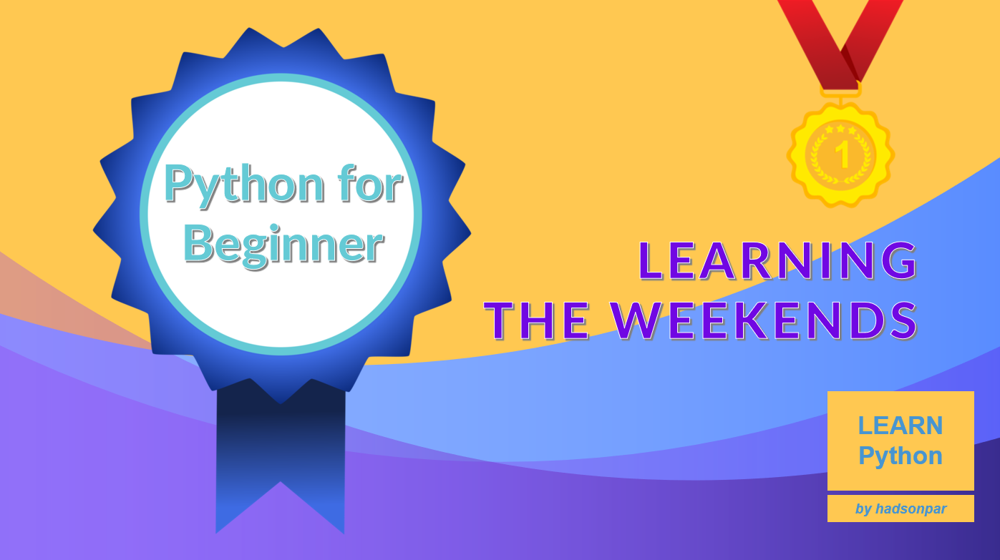

# Learn Python
## Python for Beginner
Learning the weekends.

* Author: [Hadson Paredes Cordova](https://www.linkedin.com/in/hadson-paredes-cordova/ "IT Solutions Architecture | Software Dev | AI, ML, DL | Data Science | Agile | Cloud")

## Learning Python - Tutorials for beginner
1. Our first Python Program
    - Hello World
    - [Hello World](01.Our_first_Python_Program/helloworld.py)
2. [Variables](02.Variables/variables.py)
3. [Data types](03.Data_types/datatypes.py)
    - str
    - numbers
    - sequences
    - mapping
    - sets
    - boolean
    - binary
    - none
    
4. [Operators](04.Operators/operators.py)
    - Python Arithmetic Operators
    - Python Comparison Operators
    - Python Logical Operators
    - Python Identity Operators
    - Python Bitwise Operators
    - Python Assignment Operators
    - Python Membership  Operators
5. Control_flows
    - [if, else and elif](05.Control_flows/conditionals.py)
    - [loops](05.Control_flows/loops.py)
6. [Functions](06.Functions/functions.py)
7. [Modules](07.Modules/main.py)
8. [Exception](08.Excepts/excepts.py)
9. [Classes and objects](09.Classes_and_objects/classesobjects.py)
10. [Libraries most used](10.Libraries_most_used/libraries.py)